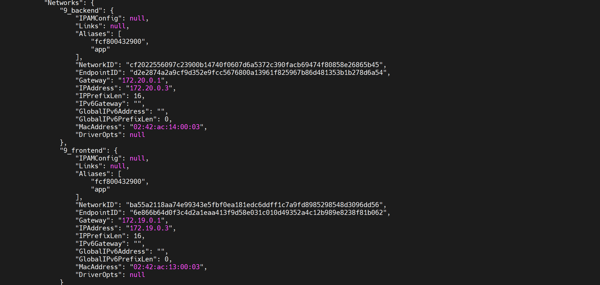
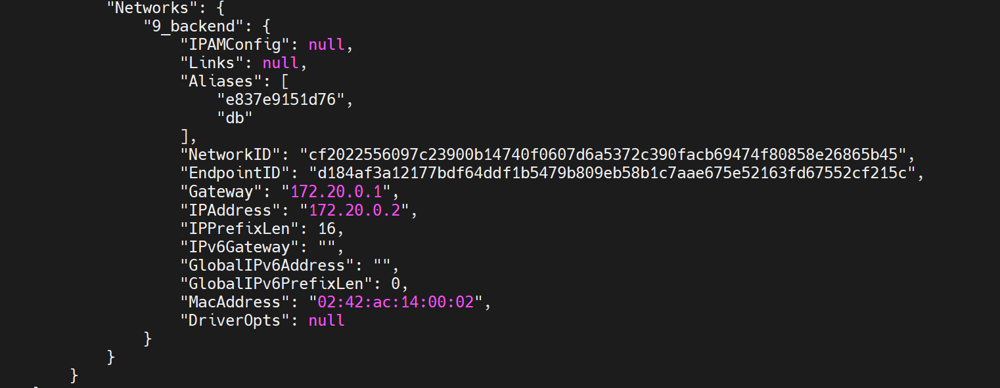
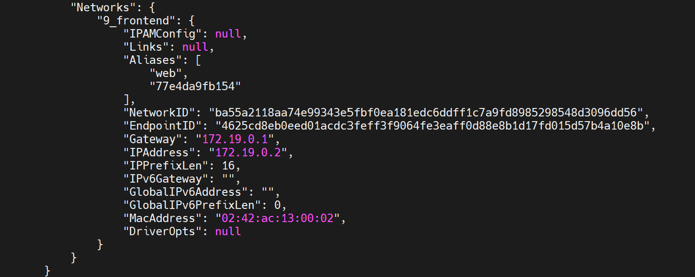

# Observation de l’isolation réseau entre 3 conteneurs

### Faire le docker-compose.yml
```yml
version: '3'

services:
  web:
    image: praqma/network-multitool
    networks:
      - frontend

  app:
    image: praqma/network-multitool
    networks:
      - frontend
      - backend

  db:
    image: praqma/network-multitool
    networks:
      - backend

networks:
  frontend:
  backend:
```

### On lance docker inspect sur nos conteneurs

```bash
docker inspect [ID]
```

On observe la portion "Networks"

Pour app :



On remarque deux IP, 172.19.0.3 et 172.20.0.3, on en déduis que ce conteneurs peut accéder à ces deux réseaux.

Pour db :



On remarque ici l'IP 172.20.0.2 c'est-à-dire de db ne peux accéder qu'a ce réseau.

Pour web :



Ici on voit le l'IP 172.19.0.2.

On en conclu que app peut communiquer avec web et db mais les conteneurs web et db ne peuvent pas communiquer car ne sont pas dans le même réseau.

### Situation réelle 

Dans une situation réelle on peut avoir :

- web : nginx (serveur web)
- app : une image d'application comme node.js
- db : postgresql pour la base de données

Ainsi on a plus de sécurité. Les utlisateurs ont accées au frontend c'est-à-dire le serveur web et l'app. Mais par contre ils n'ont pas accés à la base de données et par conséquent, pas accés aux données des utilisateurs.