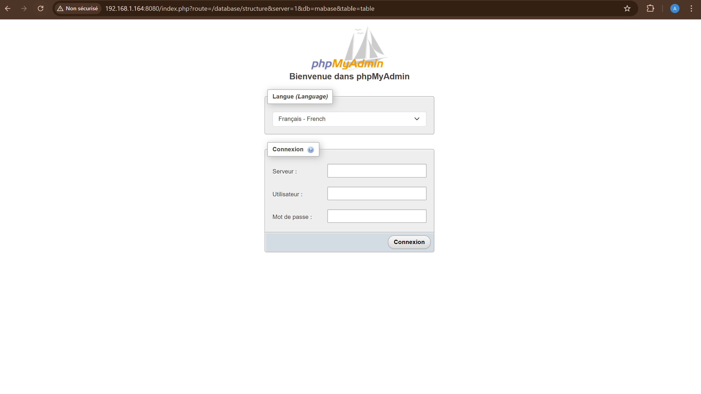

# Utiliser docker-compose.yml

### Création docker-compose.yml
```bash
nano docker-compose.yml
```

### Le script
```yml
version: '3'

services:
  db:
    image: mysql:5.7
    container_name: mysql-container
    environment:
      MYSQL_ROOT_PASSWORD: monmotdepasse
      MYSQL_DATABASE: mabase
    ports:
      - "3306:3306"
    volumes:
      - db_data:/var/lib/mysql
    networks:
      - mysql-network

  phpmyadmin:
    image: phpmyadmin/phpmyadmin
    container_name: phpmyadmin-container
    environment:
      PMA_HOST: db
      PMA_PORT: 3306
      PMA_ARBITRARY: 1
    ports:
      - "8080:80"
    depends_on:
      - db
    networks:
      - mysql-network

volumes:
  db_data:

networks:
  mysql-network:
    external: true
```

### Créer le réseau si ce n'est pas fait 
```bash
docker network create mysql-network
```

### Executer 
```bash
docker-compose up -d
```

### PhpMyAdmin
On retrouve bien le conteneur fonctionel



### Les avantages :
- Facile à reproduire
- Fonctionne comme des scripts
- Permet d'arreter et lancer plusieurs conteneurs avec une seule commande
- Gestion des configurations des conteneurs, des reseaux et des volumes

### Les variables
Les variables d'environnement permettent de pouvoir créer le premier utilisateur.
Ces dernières peuvent être mis dans un autres fichier afin qu'elle n'apparaissent pas en clair dans le fichier.
